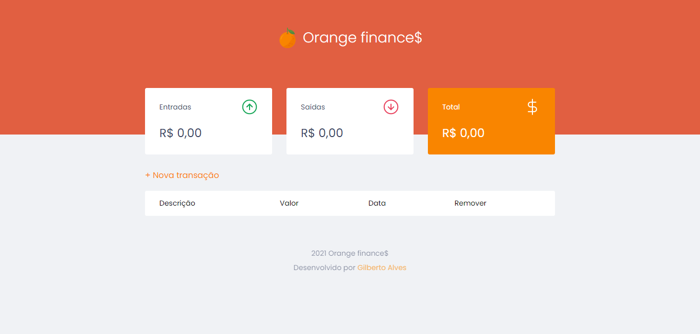

<h1 align="center">Orange finances</h1>
<h1 align="center"></h1>

<hr>

### 📚 Sobre

Orange finances, é a minha versão para o aplicativo dev.finances, desenvolvido durante a Maratona Discover, realizada pela Rocketseat.
O aplicativo consiste em gerenciar suas finanças de forma rápida e simples, com um sistema de cálculo das transações realizadas pelo usuário.

### 🎨 Detalhe

Neste aplicativo, foi utilizado o localStorage, uma funcionalidade do JavaScript para o armazenamento de dados localmente no navegador do usuário.

<hr>

### 🔥 Como contribuir

```
Fork este respositório
Faça as mudanças
Abra um pull request
```

### 💻 Tecnologias utilizadas

Nesta Calculadora Javascript foram utilizadas as seguintes tecnologias

- [HTML](https://www.w3schools.com/html/)
- [CSS](https://www.w3schools.com/css/)
- [JavaScript](https://www.w3schools.com/js/)

### ✈️ Como acessar o Jogo

Hospedado no Netlify

https://mata-mosquito-gsj.netlify.app/

Ou então 

```
Faça o download do repositório e execute index.html
```

### 📃 Licença

Este projeto está sobre a licença <a href="https://github.com/GilbertoASJ/Mata-mosquito/blob/main/LICENSE">MIT</a>
